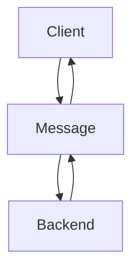

# Protocol

The client can perform

## Client to Server

**message schema**

-   origin - the casting origin
-   effect - the effect type
-   payload - the message payload

example message for lighting an enemy aflame

```json
{
	origin: <uuid>,
	effect: "fire",
	payload: {
		target: <uuid>,
		power: 10
	}
}
```

```js
interval(
	() => {
		summon('wisp').move();
	},
	2000,
	onKey('E')
);
```

other messages related to synchronization of data should be communicated through other channels, this protocol is just for the transfer sorcery related effects


